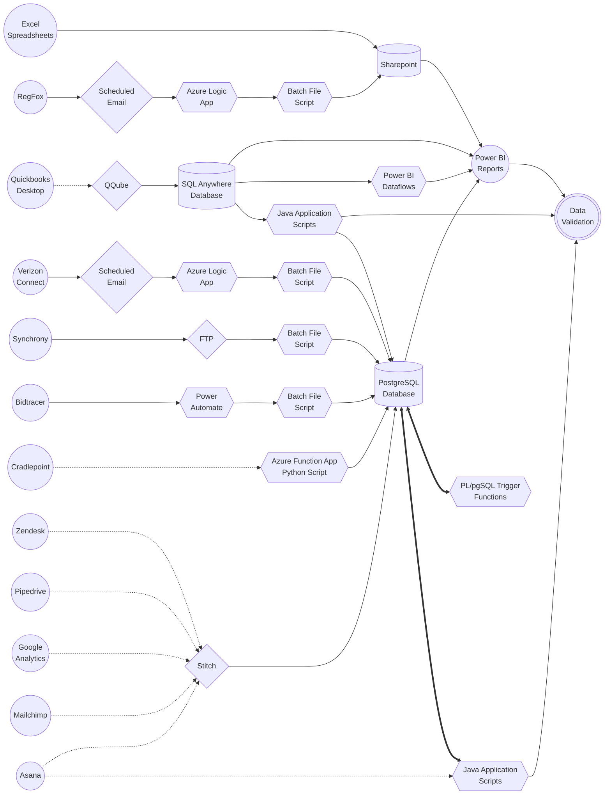

[Microsoft]: https://powerbi.microsoft.com/
[Azure Portal]: https://portal.azure.com/
[Azure Data Factory]: https://adf.azure.com/
[Power Automate]: https://powerautomate.microsoft.com/
[Stitch]: https://app.stitchdata.com/
[Sharepoint]: https://acesstl.sharepoint.com/sites/powerbi/Shared%20Documents/Forms/AllItems.aspx
[Bidtracer]: https://www.bidtracer.com/
[Zendesk]: https://automaticcontrols.zendesk.com/access/unauthenticated
[RegFox]: https://www.regfox.com/
[Asana]: https://app.asana.com/
[Cradlepoint]: https://accounts.cradlepointecm.com/
[Pipedrive]: https://app.pipedrive.com/auth/login
[Mailchimp]: https://login.mailchimp.com/
[Google Analytics]: https://analytics.google.com/analytics/web/
[Synchrony]: https://crn.prismhr.com/crn/auth/#/login?lang=en
[Quickbooks]: https://quickbooks.intuit.com/
[QQube]: https://clearify.com/wiki/view/1422/getting-started
[Microsoft Teams]: https://www.microsoft.com/en-us/microsoft-teams/group-chat-software
[GitHub]: https://github.com/automatic-controls/powerbi
[Verizon Connect]: https://reveal.fleetmatics.com/login.aspx
[Verizon Developer Connect]: https://fim.us.fleetmatics.com/

# Power BI Documentation

- [Power BI Documentation](#power-bi-documentation)
  - [Data Flowchart](#data-flowchart)
  - [Languages](#languages)
  - [Overview](#overview)
  - [Scripts](#scripts)
    - [Stitch Integration Schedules](#stitch-integration-schedules)
    - [asana-ghost-clean](#asana-ghost-clean)
    - [postgresql-backup](#postgresql-backup)
    - [synchrony](#synchrony)
    - [qqube-sync](#qqube-sync)
    - [qqube-validate](#qqube-validate)
    - [zendesk-validate](#zendesk-validate)
    - [bidtracer](#bidtracer)
    - [verizon](#verizon)
    - [regfox](#regfox)
    - [cradlepoint](#cradlepoint)
  - [Development](#development)

## Data Flowchart

Circle nodes denote a user-facing endpoint. Cylinder nodes denote a type of data storage container. Hexagon nodes specify a data processing machanism where we have complete, fine-grained control over all steps in the procedure. Rhombus nodes indicate a data processing mechanism over which we do not have complete control. Dotted arrows represent data transfers occurring through a RESTful web API. The exception to this rule is [Quickbooks Desktop][Quickbooks] which exposes data through an SDK. However, it is our intention to migrate to [Quickbooks Online][Quickbooks] in a year or two, which does include a RESTful web API.



| Data Source | Description |
| - | - |
| [Sharepoint] | Cloud storage for Excel spreadsheets which require manual data entry |
| [Synchrony] | HR services, payroll, timecard, and insurance management |
| [Quickbooks] | Accounting software for company financial data |
| [Asana] | Task organization and planning software |
| [Bidtracer] | Sales software to track bids and proposals |
| [Zendesk] | Software to track tickets submitted by customers and technicians |
| [Pipedrive] | Sales software to track potential upcoming projects |
| [RegFox] | Software to manage customer training event registration |
| [Cradlepoint] | Network routing devices which create a VPN between remote sites and ACES |
| [Verizon Connect] | GPS tracking software to monitor ACES vehicle location and usage. |
| [Mailchimp] | Marketing software platform |
| [Google Analytics] | Analytics service which records usage statistics and web traffic on the ACES website |

## Languages

These languages are listed in approximate order of their importance. You should have a decent understanding of every language listed here if you hope to maintain and/or update the existing architecture we use for Power BI. You should also be familiar with [GitHub].

| Language | Primary Usage |
| - | - |
| [PostgreSQL PL/pgSQL](https://www.postgresql.org/docs/) | General database queries |
| [Data Analysis Expressions (DAX)](https://learn.microsoft.com/en-us/dax/) | Power BI measures |
| [Java](https://jdk.java.net/) | Desktop applications to gather, process, and organize data |
| [Power Query M Formula](https://learn.microsoft.com/en-us/powerquery-m/) | Simple data manipulation in Power BI |
| [Batch Files](https://learn.openwaterfoundation.org/owf-learn-windows-shell/) | Scripts to upload CSV files to the database |
| [Regular Expressions](https://developer.mozilla.org/en-US/docs/Web/JavaScript/Guide/Regular_Expressions/Cheatsheet) | Parses data from text fields |
| [PowerShell](https://learn.microsoft.com/en-us/powershell/) | Small scripts for operations that batch files do not support |
| [SQL Anywhere](https://help.sap.com/docs/SAP_SQL_Anywhere/93079d4ba8e44920ae63ffb4def91f5b/f3c043ea50ed48e68b1c73774e2a2608.html) | Financial database queries |
| [Python](https://www.python.org/) | Azure function to extract data |
| [Markdown](https://www.markdownguide.org/) | Documentation |

## Overview

All scripts and power BI automation are based out of the **ACES-Utility2** server. When connected to the ACES network, you can RDP into the server using the provided credentials. Be sure to use the **AUTOMATICCONTRO** domain. Most scripts on the server are triggered using scheduled tasks.

When errors occur, scripts are typically configured to send email notifications. There are three places required to change the recipients of these notifications. The first place is the `error_email` variable in the *./env_vars.bat* script located at the root of this repository. The second place is in the [Power Automate] cloud flow named *Power BI notifications forwarding*. The third place is in the [Power Automate] desktop flow named *Bidtracer* on **ACES-Utility2**.

Most data is sent to a PostgreSQL database for processing and historical storage before Power BI reports ever touch it. I would suggest inspecting this database with [Azure Data Studio](https://azure.microsoft.com/en-us/products/data-studio/) to get familiar with its structure. If you're accessing the database from an unknown IP, you'll need to add a firewall rule in the [Azure Portal].


For accessing the database via command line or batch scripts, I suggest using PSQL, which can be downloaded as a stand-alone command line tool using the [PostgreSQL](https://www.postgresql.org/download/) installer. For accessing the database with a Java application, I suggest using the latest [JDBC connector](https://jdbc.postgresql.org/download/).

There is a secondary [SQL Anywhere](https://help.sap.com/docs/SAP_SQL_Anywhere) database which is only used for [Quickbooks] financial data. [QQube] synchronizes data daily from the desktop version of Quickbooks (located on **ACES-Utility2**). This database can only be directly accessed from  **ACES-Utility2**, so you'll have to RDP into it and use `dsn=QQubeFinancials` or `dsn=QQubeUser`. If prompted for a password, it is `Financials` and `User`, respectively for each DSN.

For convenience, there exists a Java application which synchronizes one job table in the QQube database to PostgreSQL. There are also a few [dataflows](https://learn.microsoft.com/en-us/power-bi/transform-model/dataflows/dataflows-create) which gather and preprocess particular piecees of data from the QQube database. Both of these options allow bits of the QQube database to be accessible from outside of **ACES-Utility2**.

Note that there is a bug in Power BI when querying dataflows. The data will appear to refresh perfectly in PBI desktop, but then it will mysteriously fail when refreshed from the PBI service. The cause of this bug is a `version` tag which is automatically generated by the PBI desktop editor. This tag must be manually removed when collecting data from dataflows. See the following screenshots.


A few Azure logic apps are used to capture email attachments and download them to **ACES-Utility2**. At which point, scheduled scripts grab the downloaded attachments and upload them to the PostgreSQL database. Some Excel spreadsheets are directly referenced in Power BI for data that must be manually entered. These spreadsheets typically live on **ACES-Utility2** and in [Sharepoint]. I recommend that spreadsheets be queried from [Sharepoint] instead of **ACES-Utility2** when connecting data sources in Power BI.

After publishing new Power BI reports, you will want to attempt to manually refresh them on the service. If any errors occur, you should go into settings to make sure the service is mapping all the data sources appropriately. Sometimes, credentials from PBI desktop do not seemlessly transfer to the service when published. Typically, you will setup all reports to have a daily scheduled refresh.

## Scripts

### Stitch Integration Schedules

[Stitch] is used to pull data from various RESTful web APIs into the PostgreSQL database. Stitch API requests are scheduled to occur at specific times for each data source.

| Data Source | Integration Schedule |
| - | - |
| [Asana] | Every 6 hours |
| [Zendesk] | Every 12 hours |
| [Pipedrive] | Every 12 hours |
| [Mailchimp] | Disabled |
| [Google Analytics] | Disabled |

There are a few problems with the Stitch integrations. Since the Asana integration takes a long time (multiple hours) to synchronize everything, it is on my TODO list to create a Java application which replaces this functionality. When nodes are deleted from the source, Stitch will not delete them from the database. Stitch only updates existing nodes or creates new nodes. This is most problematic for Asana, which is why I created a Java application to delete these ghost nodes from the Asana database.

### [asana-ghost-clean](./asana-ghost-clean/)

The purpose of this script is to delete ghost projects and tasks from the [Asana] schema in the PostgreSQL database.

1. A scheduled task (daily at 12:30AM) on **ACES-Utility2** with name *AsanaDatabaseGhostCleaner* executes a batch script: [*./asana-ghost-clean/exec.bat*](./asana-ghost-clean/exec.bat).
2. The batch script executes a Java application *./asana-ghost-clean/asana-ghost-clean.jar*.
3. The Java application deletes projects and tasks from the PostgreSQL database when they do not exist in [Asana] (usually indicates these items existed at one time but have since been deleted).

If an error occurs at any step in the process, the batch script is configured to send email notifications. Detailed error information can be found in *./asana-ghost-clean/log.txt*.

### [postgresql-backup](./postgresql-backup/)

The purpose of this script is to backup a few important tables from the PostgreSQL database.

1. A scheduled task (daily at 4:00AM) on **ACES-Utility2** with name *PostgreSQL Database Backup* executes a batch script: [*./postgresql-backup/backup.bat*](./postgresql-backup/backup.bat).
2. The script exports a few tables from the PostgreSQL database as CSV files. A maximum of 5 distinct backups can be saved at the same time.

If an error occurs at any step in the process, the batch script is configured to send email notifications. Detailed error information can be found in *./postgresql-backup/log.txt*.

### [synchrony](./synchrony/)

This data flow has not been setup yet. It is expected that [Synchrony] reports (in CSV, XLS, or XLSX format) will be sent to us daily through an FTP server. Then a batch file and/or Java application will process and upload the data to the PostgreSQL database. There exists a PostgreSQL trigger on the timesheet table which sets a `last_modified` timestamp on each row: [*./synchrony/trigger.sql*](./synchrony/trigger.sql).

### [qqube-sync](./qqube-sync/)

The purpose of this script is to synchronize a [Quickbooks] job table from the SQL Anywhere database to the PostgreSQL database.

1. [QQube] synchronizes data from Quickbooks into the SQL Anywhere database early in the morning every day.
2. A scheduled task (everyday at 12:00PM) on **ACES-Utility2** with name *qqube-postgresql-sync* executes a batch script: [*./qqube-sync/exec.bat*](./qqube-sync/exec.bat).
3. The batch script executes a Java application *./qqube-sync/qqube-sync.jar*.
4. The Java application copies data from `QQubeUser.vd_Job` in the SQL Anywhere database to `quickbooks.jobs` in the PostgreSQL database using last-modified timestamps to determine what needs updating.

If an error occurs at any step in the process, the batch script is configured to send email notifications. Detailed error information can be found in *./qqube-sync/log.txt*.

### [qqube-validate](./qqube-validate/)

The purpose of this script is to verify job numbers and custom fields are typed into [Quickbooks] correctly.

1. A scheduled task (every Wednesday at 1:00AM) on **ACES-Utility2** with name *QQubeValidation* executes a batch script: [*./qqube-validate/exec.bat*](./qqube-validate/exec.bat).
2. The batch script executes a Java application *./qqube-validate/qqube-validate.jar*.
3. The Java application inspects the SQL Anywhere database for any jobs that do not meet validation requirements. These bad jobs are printed to the standard output stream. Afterwards, control is returned to the batch script.
4. The batch script redirects the standard output stream from the Java application to *./qqube-validate/log.txt*. If any bad jobs exist or any errors occur, the batch script sends email notifications with *./qqube-validate/log.txt* as an attachment.

### [zendesk-validate](./zendesk-validate/)

The purpose of this script is to ensure job numbers are typed into [Zendesk] tickets correctly. Zendesk ticket numbers are cross-validated against data from [Quickbooks].

1. A scheduled task (every Friday at 1:00AM) on **ACES-Utility2** with name *ZendeskValidate* executes a batch script: [*./zendesk-validate/exec.bat*](./zendesk-validate/exec.bat).
2. The batch script executes a Java application *./zendesk-validate/zendesk-validate.jar*.
3. The Java application queries a list of Quickbooks jobs and Zendesk tickets from the PostgreSQL database. A list of bad tickets (if any exist) is emailed to dstclair@automaticcontrols.net and zdhom@automaticcontrols.net.

If an error occurs at any step in the process, the batch script is configured to send email notifications. Detailed error information can be found in *./zendesk-validate/log.txt*.

Eventually, the intention is that bad tickets will be emailed to their creators. Emailing the entire list to Desiree and Zach is a temporary configuration to verify that all expectations are met.

### [bidtracer](./bidtracer/)

The purpose of this script is to gather data from [Bidtracer] and upload it to the PostgreSQL database. Collected data includes a list of awarded bids with contract prices and estimated hours separated by category.

1. A [Power Automate] cloud flow (*Bidtracer Trigger*) initiates a power automate desktop flow (*Bidtracer*) daily at 12:00AM.
2. The desktop flow navigates to <https://www.bidtracer.com/> and downloads an XLSX report file.
3. The desktop flow initiates a batch script: [*./bidtracer/import.bat*](./bidtracer/import.bat).
4. The batch script converts the XLSX file to the CSV format and uploads it to the PostgreSQL database.
5. A PostgreSQL trigger is invoked to delete duplicate Bidtracer rows: [*./bidtracer/trigger.sql*](./bidtracer/trigger.sql).

If an error occurs at any step in the process, the batch script is configured to send email notifications. Detailed error information can be found in *./bidtracer/log.txt*.

### [verizon](./verizon/)

The purpose of this script is to gather data from [Verizon Connect] and upload it to the PostgreSQL database. Collected data includes GPS ping locations on ACES vehicles (taken every 30 seconds). Additionally, safety violations such as speeding and hard-braking are recorded.

1. <powerbi@automaticcontrols.net> receives three emails from Verizon (no-reply@verizonconnect.com) everyday between 4:00AM and 6:00AM. Each email contains one report in CSV format. Each report corresponds to one table in the PostgreSQL database: *movements*, *speeding*, and *incidents*.
2. The **verizon-email-capture** logic app on [Azure Portal] captures emails from Verizon with subject containing the phrase: *Scheduled Report*.
3. Attachments from captured emails are saved to *./verizon/\*.csv* on the **ACES-Utility2** computer.
4. Captured emails are moved to the *deleted* mailbox.
5. A scheduled task (daily at 6:30AM) ON **ACES-Utility2** with name *VerizonDataImport* executes a batch script: [*./verizon/import.bat*](./verizon/import.bat).
6. The batch script uploads each CSV file attachment to the appropriate table in the PostgreSQL database.
7. PostgreSQL triggers are invoked to delete duplicate rows: [*./verizon/trigger.sql*](./verizon/trigger.sql).

If an error occurs at any step in the process, the batch script is configured to send email notifications. Detailed error information can be found in *./verizon/log.txt*.

### [regfox](./regfox/)

[RegFox] is software used to manage customer training event registration. The data we get from here is essentially a list of customers and employees with the classes they are registered to attend.

1. <powerbi@automaticcontrols.net> receives an email from RegFox (noreply@webconnex.com) every day a little after 6:00AM.
2. The **regfox-email-capture** logic app on [Azure Portal] captures emails from RegFox with subject: *Your RegFox Report Is Ready For Download*.
3. The body of the email is saved to *./regfox/body.html* on the **ACES-Utility2** computer.
4. The captured email is moved to the *deleted* mailbox.
5. A scheduled task (daily at 7:00AM) on **ACES-Utility2** with name *RegFoxDataImport* executes a batch script: [*./regfox/import.bat*](./regfox/import.bat).
6. The script uses *PowerShell* ([*./regfox/parse.ps1*](./regfox/parse.ps1)) to retrieve a download URL from *./regfox/body.html*.
7. The script uses [*Curl 7.84.0*](https://curl.se/windows/) to download a CSV document from the URL.
8. The CSV document is moved to *C:\Users\powerbi\Automatic Controls Equipment Systems, Inc\Power BI - Documents\2-Reference Data\Training Data\registrants.csv*.
9. The script deletes *./regfox/body.html*.
10. The CSV document is automatically synced / uploaded to [Sharepoint].

If an error occurs at any step in the process, the batch script is configured to send email notifications. Detailed error information can be found in *./regfox/log.txt*.

### cradlepoint

The purpose of this script is to move data from the [Cradlepoint API](https://developer.cradlepoint.com/) into the PostgreSQL database.

1. The *acesfuncy1* function app with the *cradlepointAPIExtract* function on [Azure Portal] runs daily at 1:30PM.
2. The function uses some Python scripts to put data from [Cradlepoint] into the PostgreSQL database.

Python script source code is available on [Azure Portal]. In the past, this script has failed when Cradlepoint adds new columns to their API. As of now, the script is configured to send emails to the wrong place (an old IT consultant's email). I haven't bothered to fix it yet because it won't let me edit the script online. There's probably a way to do it, but I haven't taken the time.

## Development

This section describes a few prerequisites for getting the scripts in this repository to function correctly. Some scripts may not work outside of **ACES-Utility2** at all, but others could have partial functionality. The location of this repository on **ACES-Utility2** is *C:\ACES\scripts*.

1. Clone this repository to your computer.
2. Install the latest [JDK](https://jdk.java.net/), [PSQL](https://www.postgresql.org/download/), and [Curl](https://curl.se/windows/). Ensure the *./bin* folder of each installation is added to your *PATH* environment variable.
3. Create a batch file *./env_vars.bat* in the root of this repository. Populate it with the required credentials. An example is shown below.

```bat
set "lib=%~dp0lib"
set "pbi_email=pbi@email.com"
set "pbi_password=12345678"
set "error_email=abcdefghijk@amer.teams.ms;username@automaticcontrols.net"
set "postgresql_url=postgresql.database.net"
set "postgresql_user=username"
set "postgresql_pass=12345678"
set "asana_token=1/1111111111:ffffffffffffff"
```

4. Execute [*./collect.bat*](./collect.bat) to download required dependencies.
5. After making changes to source code, run the build script for each Java application script as necessary.

| Build Script |
| - |
| [*./asana-ghost-clean/build.bat*](./asana-ghost-clean/build.bat) |
| [*./qqube-sync/build.bat*](./qqube-sync/build.bat) |
| [*./qqube-validate/build.bat*](./qqube-validate/build.bat) |
| [*./zendesk-validate/build.bat*](./zendesk-validate/build.bat) |